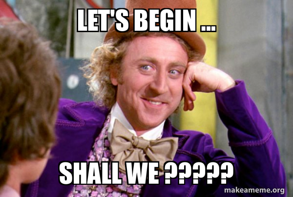

# Introduction to Docs

I add an in depth introduction and an overview of the things that I work on in here.

## Getting Started

Before trying to run the project, make sure you have all the necessary dependencies installed.

I usually prototype and develop my projects using Python. For times when I need to use other languages, I'll mention it in the project's README or under the first section of the documentation.

### What you'll need

- The latest version of [Python](https://www.python.org/downloads/). ( I currently use Python 3.11 )
- I recently started using Poetry for managing dependencies. It's a great tool and I highly recommend it. Helps me keep track of all the dependencies and their versions. You can check it out [here](https://python-poetry.org/docs/).
- Editor of your choice. I use [VSCode](https://code.visualstudio.com/).

Once you are setup

